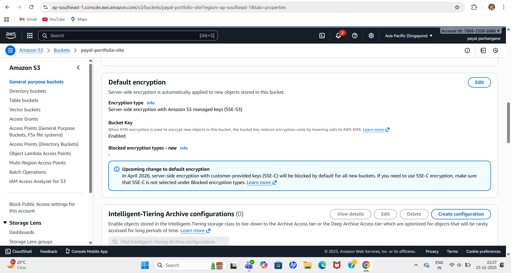
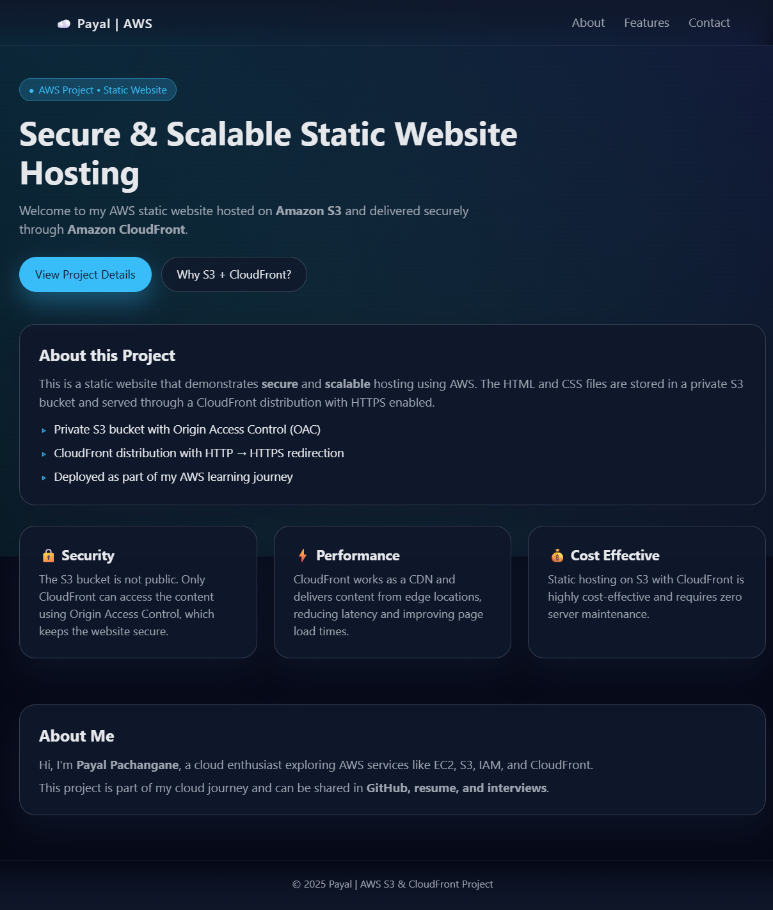

# Secure & Scalable Static Website Hosting using AWS S3 and CloudFront

This project demonstrates how to host a secure, scalable static portfolio website using **Amazon S3** as the origin and **Amazon CloudFront** as the Content Delivery Network (CDN).  
The website is stored in a private S3 bucket and delivered securely through a CloudFront distribution.

---

## 🏗 Architecture Overview

- **Amazon S3** – Stores static website files (`index.html`, `style.css`, etc.).
- **Amazon CloudFront** – Distributes the content globally with low latency.
- **S3 Bucket Policy** – Restricts direct public access and only allows CloudFront to read objects.
- **Default Encryption** – All objects in the S3 bucket are encrypted at rest.
- **Static Website Hosting** – Enabled on the S3 bucket for website endpoint (used as CloudFront origin).

---

## 📁 S3 Configuration

### 1️⃣ S3 Bucket – Static Website Files

The S3 bucket `payal-portfolio-site` stores all the static assets of the portfolio website.

Example files:
- `index.html`
- `style.css`
- `README.md`

---

### 2️⃣ Default Encryption (SSE-S3)

The S3 bucket is configured with **default server-side encryption (SSE-S3)**.  
All new objects uploaded to this bucket are automatically encrypted using Amazon S3 managed keys.

**Key points:**
- **Encryption type:** SSE-S3  
- **Bucket Key:** Enabled  

This ensures that all data stored in the bucket is **encrypted at rest**, improving security and following best practices.

---

### 3️⃣ Static Website Hosting

.png)

The S3 bucket is configured for **static website hosting**.

**Configuration details:**
- **Static website hosting:** Enabled  
- **Hosting type:** Bucket hosting  
- **Bucket website endpoint:**  
  `http://payal-portfolio-site.s3-website-ap-southeast-1.amazonaws.com`

This endpoint is used as the **origin** for the CloudFront distribution.

---

### 4️⃣ Bucket Policy & Permissions

.png)

- **Public access blocked** via S3 Block Public Access.
- Only the **CloudFront distribution** can access bucket objects.
- Ensures content is **securely delivered** and bucket is **not publicly accessible**.
---

## 🌍 CloudFront Configuration

### 5️⃣ CloudFront Distribution – General Details

.png)

- **Origin:** S3 bucket `payal-portfolio-site`  
- **Domain:** `d1m6el92zo8940.cloudfront.net`  
- **Price class:** All edge locations  

This enables **low-latency global access**.

---

### 6️⃣ CloudFront Origin – S3 Integration

.png)

The **Origins** tab shows that the CloudFront distribution uses the S3 bucket as its origin.

**Key points:**
- Origin domain: `payal-portfolio-site.s3-website-ap-southeast-1.amazonaws.com`
- Origin type: S3 static website endpoint

This confirms that **all content is fetched from the S3 static website hosting endpoint** and then cached and delivered by CloudFront.

---

### 7️⃣ CloudFront Cache Behavior & Security

.png)

- **Viewer protocol policy:** Redirect HTTP → HTTPS  
- **Allowed HTTP methods:** GET, HEAD  

This ensures **secure HTTPS access** and minimal required methods.  
Default caching behavior improves **performance** by storing content at edge locations, reducing latency for global users.

---

### 8️⃣ CloudFront Invalidation – Cache Refresh

.png)

To make sure that content updates in S3 are reflected quickly to users, **CloudFront invalidations** are used.

**Example invalidation:**
- **Object paths:** `/*`
- **Status:** Completed

Invalidating `/*` ensures that the entire cache is refreshed, and users see the **latest version** of the website without waiting for cache expiry.

---

 with S3 origin & update bucket policy to allow only CloudFront  

## 🌐 Live Website

Access the website via CloudFront HTTPS URL:

`https://d1m6el92zo8940.cloudfront.net`

This demonstrates:
- Website hosted on **Amazon S3**
- Delivered securely via **CloudFront** with **HTTPS**
- **Origin Access Control (OAC)** keeps S3 private
- Low latency delivery via CloudFront CDN

---

## ✅ Features Demonstrated

- S3 static website hosting
- CloudFront HTTPS delivery
- SSE-S3 bucket encryption
- Restricted access (CloudFront only)
- Cache invalidation for updates
---

## 🚀 How to Use This Setup for Your Own Projects

1. Create S3 bucket & upload files
2. Enable static website hosting
3. Configure SSE-S3 encryption
4. Create CloudFront distribution with S3 origin
5. Update bucket policy for CloudFront only
6. Use CloudFront HTTPS URL
7. Invalidate cache after updates

---

## 🧾 Summary

This repository is a practical example of **secure static website hosting on AWS** using:

- **Amazon S3** for storing static website files in a private, encrypted bucket  
- **S3 Static Website Hosting** as the origin for CloudFront  
- **Amazon CloudFront** for global, low-latency, HTTPS content delivery  
- **Bucket policies** to block direct public access and allow only CloudFront  
- **CloudFront invalidations** to quickly push new content to users  

Together, this setup delivers a **fast, secure, and scalable static portfolio website** following real-world AWS best practices.
